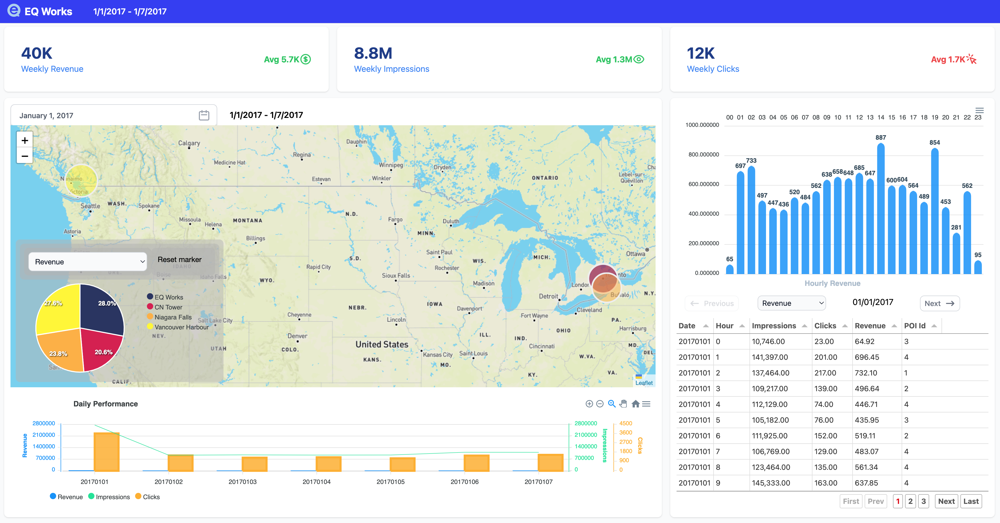

# minboard



Minimalist dashboard built with:
- svelte
- tailwind
- leaflet
- apexchart
- lodash

## Creating a project

```bash
# cloning repo
git clone https://github.com/furqon/minboard.git

# go to folder
cd minboard

# install dependecy
npm i

# change environement variable
cp .env.example .env

# run dev
npm run dev -- --open
```
 
## Building  
To create a production version of your app:
```bash
npm run build
```
